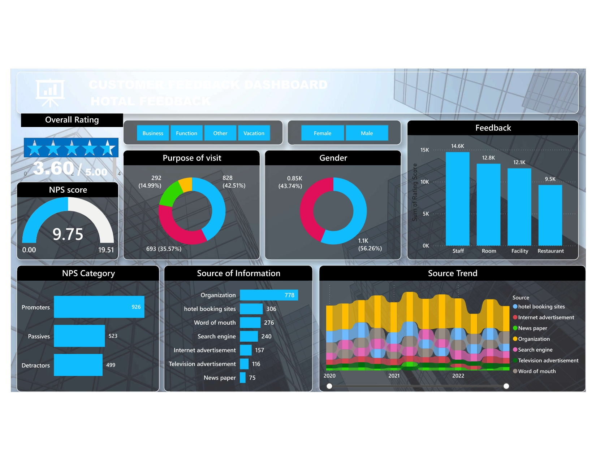

# 📊 Customer Analytics Dashboard

**Power BI Project | Customer Segmentation, Behavior & Profitability**

This is a personal Power BI dashboard project built to explore customer analytics using data visualization and advanced DAX calculations. The goal was to convert raw customer data into business insights that support marketing, retention, and sales decisions.

---

## 🎯 Objectives

- Analyze customer demographics and buying behavior
- Segment customers by value and frequency
- Identify retention gaps and top-performing segments
- Build visually intuitive dashboards for business stakeholders

---

## 📊 Key Features

- **Customer Overview Page**  
  Displays total customers, average order value, and customer trends.

- **Profit Analysis**  
  Tracks revenue, profit margin, and high-profit customers.

- **Customer Segmentation**  
  Identifies customer groups using behavioral data and contribution to revenue.

- **Performance Metrics**  
  KPI cards and charts for:
  - Profit by Category
  - Orders by Region
  - Sales Growth vs. Previous Period

---

## 📌 Tools Used

- **Power BI Desktop**
- **Power Query** for data shaping
- **DAX** for calculated measures (e.g., Profit %, Revenue per Customer)
- **Slicers & Filters** for interactivity by region, product, and customer segment

---

## 📁 Project Files

- `pbix/Customer Analytics Dashboard.pbix` — Power BI Report
- `assets/customer-dashboard-preview.png` — Dashboard screenshot
- `data/sample_data.csv` — (Optional anonymized sample dataset)

---

## 📷 Dashboard Preview

---

## 🚀 Insights & Impact

This dashboard equips stakeholders with:
- Quick insights into customer value
- Visual trends in regional sales performance
- A breakdown of profit-driving categories and customer clusters

---

## 🧠 What I Learned

- Implementing customer segmentation using business logic
- Writing optimized DAX measures for KPIs and filters
- Creating dashboards with UX-first thinking for decision-makers

---

## 🔮 Future Improvements

- RFM Score Breakdown (Recency, Frequency, Monetary)
- Add churn prediction logic
- Real-time data connection (SQL/CRM)
- Row-level security (RLS)

